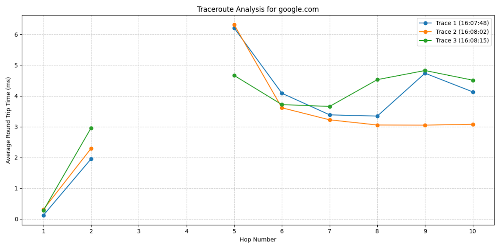

[](https://classroom.github.com/open-in-codespaces?assignment_repo_id=18563909)
# The Amazing Trace

Calculates average round trip time for each hop of a traceroute to a list of destinations.


## Functionality

Utilizes the subprocess module to traceroute to a set of destinations (IP's or hostnames), tracking details about each and every stop (hop) the signal has to go through.

#### The raw output from the stdout is parsed using regex to extract the following information:

* Hop Number
* IP Address
* Hostname (None if same as IP)
* Round Trip Time (RTT) Table

#### The data is then organized like so:
```
{
    'hop': 1,
    'ip': 127.0.0.1,
    'hostname': loopback,
    'rtt': [0.215, 0.254, 0.261]
}
```

### Data Output:
The test is run 3 times for each destination, each trace being color coded and displayed on a line graph. 


___

Lastly, the average rtt is calculated across all 3 traces and displayed in a text table like so:
```
1      0.283000
2      2.258556
3           NaN
4           NaN
5      5.427444
6     12.793667
7      3.614778
8      3.719222
9      5.006000
10     4.043111
11     3.739111 
```

## Usage

### Prerequesites

* Python 3.X (Version 3.7+ Recommended)


* Run the command `sudo apt install traceroute` to install:
    
    * Traceroute


* Run the command `pip install matplotlib pandas numpy` to install:

    * Matplotlib

    * Pandas

    * Numpy

### To Run

The script is run by calling 'amazing_trace.py' using python3:

`python3 amazing_trace.py`

### To Change the Target Destinations:
Inside the file `amazing_trace.py`, directly underneath the line `if __name__ == "__main__"`:

The destination list 'destinations'  to remove or add any website domain names or IP's

**(Default list: `destinations = ["google.com", "amazon.com", "bbc.co.uk"]`)**
